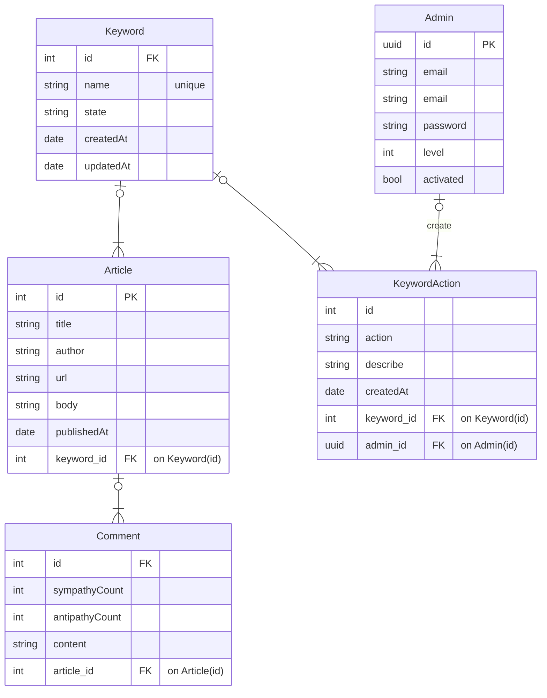

# E-R diagram

```mermaid
erDiagram
  Article {
    int id PK 
    string title
    string author
    string url
    string body
    date publishedAt
    int keyword_id FK "on Keyword(id)"
  }

  Comment {
    int id FK
    int sympathyCount
    int antipathyCount
    string content
    int article_id FK "on Article(id)"
  }

  Keyword {
    int id FK
    string name "unique"
    string state
    date createdAt
    date updatedAt
  }

  KeywordAction {
    int id
    string action 
    string describe
    date createdAt
    int keyword_id FK "on Keyword(id)"
    uuid admin_id FK "on Admin(id)"
  }

  Admin {
    uuid id PK
    string email
    string email
    string password
    int level
    bool activated
  }

  Article |o--|{ Comment: ""
  Keyword |o--|{ Article: ""
  Keyword |o--|{ KeywordAction: ""
  Admin |o--|{ KeywordAction: "create"
```